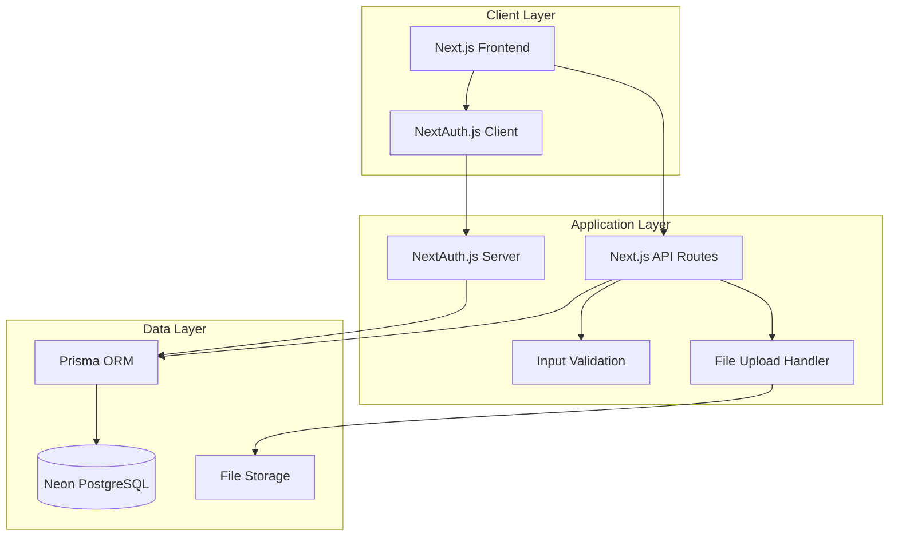

# Design Document: Student Enrollment System

## Overview

The student enrollment system is a full-stack web application built with Next.js, TypeScript, and PostgreSQL. It provides a digital replacement for the current Google Forms enrollment process, offering role-based access for parents to submit applications and for administrators/principals to review and manage submissions.

The system follows a three-tier architecture:
- **Presentation Layer**: Next.js frontend with React components, Tailwind CSS, and shadcn/ui
- **Application Layer**: Next.js API routes handling business logic and validation
- **Data Layer**: Neon serverless PostgreSQL database accessed through Prisma ORM

Key design principles:
- Role-based access control (RBAC) for security
- Server-side validation for data integrity
- Secure file storage with access controls
- Responsive design for mobile and desktop access
- Type safety throughout the application using TypeScript

## Architecture

### System Components



### Request Flow

1. **Parent Enrollment Submission**:
   - Parent fills form in UI → Form validation → API route receives data
   - API validates input → Prisma creates database records → Files uploaded to storage
   - Response returned to UI with success/error status

2. **Admin Dashboard Access**:
   - Admin/Principal authenticates → NextAuth verifies role
   - Dashboard requests enrollment list → API checks authorization
   - Prisma queries database → Results filtered and returned
   - Admin can approve/reject → API updates status → Database persisted

3. **Document Access**:
   - User requests document → API verifies authorization (role + ownership)
   - If authorized → File served from storage
   - If unauthorized → 403 error returned

## Components and Interfaces

### Frontend Components

#### EnrollmentForm Component
```typescript
interface EnrollmentFormProps {
  onSubmit: (data: EnrollmentFormData) => Promise<void>;
  initialData?: Partial<EnrollmentFormData>;
}

interface EnrollmentFormData {
  schoolYear: string;
  program: string;
  studentStatus: 'OLD_STUDENT' | 'NEW_STUDENT';
  profilePicture: File;
  personalInfo: PersonalInfo;
  parentInfo: ParentInfo;
  studentHistory: StudentHistory;
  studentSkills: StudentSkills;
  enrollmentAgreement: EnrollmentAgreement;
  documents: DocumentUpload[];
}

interface PersonalInfo {
  lastName: string;
  firstName: string;
  middleName: string;
  nameExtension?: string;
  nickname: string;
  sex: 'FEMALE' | 'MALE';
  age: number;
  birthday: Date;
  placeOfBirth: string;
  religion: string;
  presentAddress: string;
  contactNumber: string;
  citizenship: 'FILIPINO' | 'FOREIGNER';
  citizenshipSpecification?: string;
}

interface ParentInfo {
  fatherFullName: string;
  fatherOccupation?: string;
  fatherContactNumber: string;
  fatherEmail?: string;
  fatherEducationalAttainment: EducationalAttainment;
  motherFullName: string;
  motherOccupation?: string;
  motherContactNumber: string;
  motherEmail: string;
  motherEducationalAttainment: EducationalAttainment;
  maritalStatus: MaritalStatus[];
}

type EducationalAttainment = 
  | 'ELEMENTARY_GRADUATE'
  | 'HIGH_SCHOOL_GRADUATE'
  | 'COLLEGE_GRADUATE'
  | 'ELEMENTARY_UNDERGRAD'
  | 'HIGH_SCHOOL_UNDERGRAD'
  | 'COLLEGE_UNDERGRAD'
  | 'OTHERS';

type MaritalStatus = 
  | 'MARRIED'
  | 'SEPARATED'
  | 'SINGLE_PARENT'
  | 'STEPMOTHER'
  | 'STEPFATHER'
  | 'OTHER';

interface StudentHistory {
  siblingsInformation?: string;
  totalLearnersInHousehold: number;
  lastSchoolPreschoolName: string;
  lastSchoolPreschoolAddress?: string;
  lastSchoolElementaryName: string;
  lastSchoolElementaryAddress?: string;
}

interface StudentSkills {
  specialSkills: SpecialSkill[];
  specialNeedsDiagnosis?: string;
}

type SpecialSkill = 
  | 'COMPUTER'
  | 'COMPOSITION_WRITING'
  | 'SINGING'
  | 'DANCING'
  | 'POEM_WRITING'
  | 'COOKING'
  | 'ACTING'
  | 'PUBLIC_SPEAKING'
  | 'OTHER';

interface EnrollmentAgreement {
  responsiblePersonName: string;
  responsiblePersonContactNumber: string;
  responsiblePersonEmail: string;
  relationshipToStudent?: string;
  enrollmentAgreementAcceptance: 'YES_COMMIT' | 'OTHER';
  withdrawalPolicyAcceptance: 'YES_AGREED' | 'NO_DISAGREE';
}

interface DocumentUpload {
  type: DocumentType;
  file: File;
}

type DocumentType = 
  | 'REPORT_CARD'
  | 'BIRTH_CERTIFICATE'
  | 'GOOD_MORAL'
  | 'MARRIAGE_CONTRACT'
  | 'MEDICAL_RECORDS'
  | 'SPECIAL_NEEDS_DIAGNOSIS'
  | 'PROOF_OF_PAYMENT';
```

#### AdminDashboard Component
```typescript
interface AdminDashboardProps {
  userRole: 'ADMIN' | 'PRINCIPAL';
}

interface EnrollmentListItem {
  id: string;
  studentName: string;
  schoolYear: string;
  program: string;
  studentStatus: 'OLD_STUDENT' | 'NEW_STUDENT';
  status: 'PENDING' | 'APPROVED' | 'REJECTED';
  submittedAt: Date;
}

interface EnrollmentFilters {
  schoolYear?: string;
  program?: string;
  studentStatus?: 'OLD_STUDENT' | 'NEW_STUDENT';
  status?: 'PENDING' | 'APPROVED' | 'REJECTED';
}
```

#### EnrollmentDetail Component
```typescript
interface EnrollmentDetailProps {
  enrollmentId: string;
  onApprove: (id: string) => Promise<void>;
  onReject: (id: string) => Promise<void>;
}

interface EnrollmentDetail {
  id: string;
  schoolYear: string;
  program: string;
  studentStatus: 'OLD_STUDENT' | 'NEW_STUDENT';
  status: 'PENDING' | 'APPROVED' | 'REJECTED';
  profilePictureUrl: string;
  personalInfo: PersonalInfo;
  parentInfo: ParentInfo;
  studentHistory: StudentHistory;
  studentSkills: StudentSkills;
  enrollmentAgreement: EnrollmentAgreement;
  documents: DocumentInfo[];
  submittedAt: Date;
  updatedAt: Date;
}

interface DocumentInfo {
  id: string;
  type: DocumentType;
  fileName: string;
  fileSize: number;
  uploadedAt: Date;
  url: string;
}
```

### Backend API Routes

#### POST /api/enrollments
```typescript
interface CreateEnrollmentRequest {
  schoolYear: string;
  program: string;
  studentStatus: 'OLD_STUDENT' | 'NEW_STUDENT';
  personalInfo: PersonalInfo;
  parentInfo: ParentInfo;
  studentHistory: StudentHistory;
  studentSkills: StudentSkills;
  enrollmentAgreement: EnrollmentAgreement;
}

interface CreateEnrollmentResponse {
  success: boolean;
  enrollmentId?: string;
  errors?: ValidationError[];
}

interface ValidationError {
  field: string;
  message: string;
}
```

#### POST /api/enrollments/[id]/upload
```typescript
interface UploadDocumentRequest {
  enrollmentId: string;
  documentType: DocumentType;
  file: FormData;
}

interface UploadDocumentResponse {
  success: boolean;
  documentId?: string;
  url?: string;
  error?: string;
}
```

#### GET /api/enrollments
```typescript
interface GetEnrollmentsRequest {
  schoolYear?: string;
  program?: string;
  studentStatus?: 'OLD_STUDENT' | 'NEW_STUDENT';
  status?: 'PENDING' | 'APPROVED' | 'REJECTED';
  page?: number;
  limit?: number;
}

interface GetEnrollmentsResponse {
  enrollments: EnrollmentListItem[];
  total: number;
  page: number;
  totalPages: number;
}
```

#### PATCH /api/enrollments/[id]/status
```typescript
interface UpdateEnrollmentStatusRequest {
  enrollmentId: string;
  status: 'APPROVED' | 'REJECTED';
}

interface UpdateEnrollmentStatusResponse {
  success: boolean;
  enrollment?: EnrollmentDetail;
  error?: string;
}
```

#### GET /api/documents/[id]
```typescript
// Returns file stream with appropriate headers
// Authorization checked before serving file
```

### Authentication and Authorization

#### NextAuth Configuration
```typescript
interface User {
  id: string;
  email: string;
  name: string;
  role: 'PARENT' | 'ADMIN' | 'PRINCIPAL';
}

interface Session {
  user: User;
  expires: string;
}

// Authorization helper
function requireRole(roles: Role[]): Middleware {
  return async (req, res, next) => {
    const session = await getServerSession(req, res);
    if (!session || !roles.includes(session.user.role)) {
      return res.status(403).json({ error: 'Unauthorized' });
    }
    next();
  };
}
```

### Validation Layer

#### Input Validation
```typescript
interface ValidationRule {
  field: string;
  validate: (value: any) => boolean;
  message: string;
}

class EnrollmentValidator {
  validatePersonalInfo(data: PersonalInfo): ValidationError[];
  validateParentInfo(data: ParentInfo): ValidationError[];
  validateStudentHistory(data: StudentHistory): ValidationError[];
  validateStudentSkills(data: StudentSkills): ValidationError[];
  validateEnrollmentAgreement(data: EnrollmentAgreement): ValidationError[];
  validateProfilePicture(file: File): ValidationError[];
  validateDocument(file: File, type: DocumentType): ValidationError[];
  validateRequiredDocuments(
    documents: DocumentUpload[], 
    studentStatus: 'OLD_STUDENT' | 'NEW_STUDENT'
  ): ValidationError[];
}
```

#### File Validation Rules
```typescript
interface FileValidationConfig {
  maxSize: number; // in bytes
  allowedFormats: string[];
  additionalRules?: (file: File) => ValidationError[];
}

const PROFILE_PICTURE_CONFIG: FileValidationConfig = {
  maxSize: 100 * 1024 * 1024, // 100MB
  allowedFormats: ['image/jpeg', 'image/png'],
};

const DOCUMENT_CONFIG: FileValidationConfig = {
  maxSize: 10 * 1024 * 1024, // 10MB
  allowedFormats: ['application/pdf', 'image/jpeg', 'image/png'],
};
```

## Data Models

### Prisma Schema

```prisma
model User {
  id            String        @id @default(cuid())
  email         String        @unique
  name          String
  password      String
  role          Role
  enrollments   Enrollment[]
  createdAt     DateTime      @default(now())
  updatedAt     DateTime      @updatedAt
}

enum Role {
  PARENT
  ADMIN
  PRINCIPAL
}

model Enrollment {
  id                        String              @id @default(cuid())
  userId                    String
  user                      User                @relation(fields: [userId], references: [id])
  schoolYear                String
  program                   String
  studentStatus             StudentStatus
  status                    EnrollmentStatus    @default(PENDING)
  
  // Personal Information
  lastName                  String
  firstName                 String
  middleName                String
  nameExtension             String?
  nickname                  String
  sex                       Sex
  age                       Int
  birthday                  DateTime
  placeOfBirth              String
  religion                  String
  presentAddress            String
  contactNumber             String
  citizenship               Citizenship
  citizenshipSpecification  String?
  
  // Parent Information
  fatherFullName            String
  fatherOccupation          String?
  fatherContactNumber       String
  fatherEmail               String?
  fatherEducationalAttainment EducationalAttainment
  motherFullName            String
  motherOccupation          String?
  motherContactNumber       String
  motherEmail               String
  motherEducationalAttainment EducationalAttainment
  maritalStatus             MaritalStatus[]
  
  // Student History
  siblingsInformation       String?
  totalLearnersInHousehold  Int
  lastSchoolPreschoolName   String
  lastSchoolPreschoolAddress String?
  lastSchoolElementaryName  String
  lastSchoolElementaryAddress String?
  
  // Student Skills and Special Needs
  specialSkills             SpecialSkill[]
  specialNeedsDiagnosis     String?
  
  // Enrollment Agreement
  responsiblePersonName     String
  responsiblePersonContactNumber String
  responsiblePersonEmail    String
  relationshipToStudent     String?
  enrollmentAgreementAcceptance EnrollmentAgreementAcceptance
  withdrawalPolicyAcceptance WithdrawalPolicyAcceptance
  
  // Profile Picture
  profilePictureUrl         String
  
  // Documents
  documents                 Document[]
  
  createdAt                 DateTime            @default(now())
  updatedAt                 DateTime            @updatedAt
  
  @@index([userId])
  @@index([schoolYear])
  @@index([status])
  @@index([studentStatus])
}

enum StudentStatus {
  OLD_STUDENT
  NEW_STUDENT
}

enum EnrollmentStatus {
  PENDING
  APPROVED
  REJECTED
}

enum Sex {
  FEMALE
  MALE
}

enum Citizenship {
  FILIPINO
  FOREIGNER
}

enum EducationalAttainment {
  ELEMENTARY_GRADUATE
  HIGH_SCHOOL_GRADUATE
  COLLEGE_GRADUATE
  ELEMENTARY_UNDERGRAD
  HIGH_SCHOOL_UNDERGRAD
  COLLEGE_UNDERGRAD
  OTHERS
}

enum MaritalStatus {
  MARRIED
  SEPARATED
  SINGLE_PARENT
  STEPMOTHER
  STEPFATHER
  OTHER
}

enum SpecialSkill {
  COMPUTER
  COMPOSITION_WRITING
  SINGING
  DANCING
  POEM_WRITING
  COOKING
  ACTING
  PUBLIC_SPEAKING
  OTHER
}

enum EnrollmentAgreementAcceptance {
  YES_COMMIT
  OTHER
}

enum WithdrawalPolicyAcceptance {
  YES_AGREED
  NO_DISAGREE
}

model Document {
  id            String        @id @default(cuid())
  enrollmentId  String
  enrollment    Enrollment    @relation(fields: [enrollmentId], references: [id], onDelete: Cascade)
  type          DocumentType
  fileName      String
  fileSize      Int
  fileUrl       String
  mimeType      String
  uploadedAt    DateTime      @default(now())
  
  @@index([enrollmentId])
}

enum DocumentType {
  REPORT_CARD
  BIRTH_CERTIFICATE
  GOOD_MORAL
  MARRIAGE_CONTRACT
  MEDICAL_RECORDS
  SPECIAL_NEEDS_DIAGNOSIS
  PROOF_OF_PAYMENT
}
```

### Database Relationships

- **User → Enrollment**: One-to-Many (a parent can have multiple enrollment applications)
- **Enrollment → Document**: One-to-Many (an enrollment has multiple documents)
- **Cascade Delete**: When an enrollment is deleted, all associated documents are deleted

### File Storage Structure

```
/uploads
  /profile-pictures
    /{enrollmentId}
      /profile.jpg
  /documents
    /{enrollmentId}
      /{documentType}
        /{filename}
```

File naming convention: `{timestamp}-{originalFilename}`
Access control: Files served through API route that checks authorization


## Correctness Properties

A property is a characteristic or behavior that should hold true across all valid executions of a system—essentially, a formal statement about what the system should do. Properties serve as the bridge between human-readable specifications and machine-verifiable correctness guarantees.

### Property 1: Enrollment Data Persistence
*For any* valid enrollment data including school year, program, student status, and personal information, submitting the enrollment form should create a database record that contains all the submitted data.
**Validates: Requirements 1.2, 1.3, 1.5**

### Property 2: Required Field Validation
*For any* enrollment submission missing one or more required fields (lastName, firstName, middleName, nickname, sex, age, birthday, placeOfBirth, religion, presentAddress, contactNumber), the system should reject the submission and return validation errors identifying the missing fields.
**Validates: Requirements 1.6, 2.1**

### Property 3: Optional Field Handling
*For any* enrollment submission, the nameExtension field should be accepted whether present or absent, and the submission should succeed if all other required fields are valid.
**Validates: Requirements 2.2**

### Property 4: Date Validation
*For any* birthday input, the system should validate it represents a valid date and reject invalid date values (e.g., February 30, month 13, negative years).
**Validates: Requirements 2.3**

### Property 5: Conditional Citizenship Validation
*For any* enrollment with citizenship set to FOREIGNER, the system should require citizenshipSpecification to be provided, and reject submissions where it is missing.
**Validates: Requirements 2.4**

### Property 6: Validation Error Messages
*For any* enrollment submission with multiple invalid fields, the system should return specific error messages for each invalid field, allowing the user to identify all issues at once.
**Validates: Requirements 2.5**

### Property 7: Profile Picture Size Validation
*For any* profile picture upload, files exceeding 100MB should be rejected with an appropriate error message.
**Validates: Requirements 3.1**

### Property 8: Profile Picture Format Validation
*For any* profile picture upload, files that are not JPEG or PNG format should be rejected with an appropriate error message.
**Validates: Requirements 3.2**

### Property 9: Profile Picture Storage Round-Trip
*For any* valid profile picture upload, storing the image and then retrieving it by the returned URL should produce the same image data.
**Validates: Requirements 3.3**

### Property 10: Old Student Document Requirements
*For any* enrollment with studentStatus set to OLD_STUDENT, the system should require a REPORT_CARD document and PROOF_OF_PAYMENT, and reject submissions missing these documents.
**Validates: Requirements 4.1, 4.4**

### Property 11: New Student Document Requirements
*For any* enrollment with studentStatus set to NEW_STUDENT, the system should require REPORT_CARD, BIRTH_CERTIFICATE, GOOD_MORAL, MARRIAGE_CONTRACT, MEDICAL_RECORDS, and PROOF_OF_PAYMENT documents, and reject submissions missing any of these required documents.
**Validates: Requirements 4.2, 4.4**

### Property 12: Optional Special Needs Documents
*For any* enrollment with studentStatus set to NEW_STUDENT, the system should allow but not require SPECIAL_NEEDS_DIAGNOSIS documents to be uploaded.
**Validates: Requirements 4.3**

### Property 13: Document Format Validation
*For any* document upload, files that are not PDF, JPEG, or PNG format should be rejected with an appropriate error message.
**Validates: Requirements 4.5**

### Property 14: Document Storage Round-Trip
*For any* valid document upload, storing the document and then retrieving it by the returned URL should produce the same file data with the same filename and size.
**Validates: Requirements 4.6**

### Property 15: Admin Dashboard Enrollment Visibility
*For any* authorized user (ADMIN or PRINCIPAL role), accessing the dashboard should return a list containing all enrollment applications in the system.
**Validates: Requirements 5.1**

### Property 16: Enrollment Detail Retrieval
*For any* enrollment ID, when an authorized user requests the enrollment details, the system should return all submitted student information and all associated documents.
**Validates: Requirements 5.2**

### Property 17: Enrollment Filtering
*For any* filter criteria (schoolYear, program, or studentStatus), the system should return only enrollments that match all specified filter criteria, and exclude enrollments that don't match.
**Validates: Requirements 5.3, 5.4, 5.5**

### Property 18: Enrollment Approval State Transition
*For any* enrollment in PENDING status, when an authorized user approves it, the enrollment status should be updated to APPROVED and persisted to the database.
**Validates: Requirements 6.1, 6.3**

### Property 19: Enrollment Rejection State Transition
*For any* enrollment in PENDING status, when an authorized user rejects it, the enrollment status should be updated to REJECTED and persisted to the database.
**Validates: Requirements 6.2, 6.3**

### Property 20: Unauthorized Status Change Prevention
*For any* user without ADMIN or PRINCIPAL role, attempts to approve or reject enrollments should be denied with a 403 authorization error.
**Validates: Requirements 6.4**

### Property 21: Parent Role Permissions
*For any* user with PARENT role, they should be able to submit enrollment forms and view their own submissions, but should be denied access to admin features like viewing all enrollments or approving/rejecting applications.
**Validates: Requirements 7.1, 7.5**

### Property 22: Admin and Principal Role Permissions
*For any* user with ADMIN or PRINCIPAL role, they should be able to access all enrollments, view enrollment details, and approve or reject applications.
**Validates: Requirements 7.2, 7.3**

### Property 23: Authentication Requirement
*For any* unauthenticated request to protected endpoints (enrollment submission, dashboard access, document access), the system should return a 401 authentication error or redirect to login.
**Validates: Requirements 7.4**

### Property 24: Authorized Document Access
*For any* document, when an authorized user (ADMIN, PRINCIPAL, or the parent who owns the enrollment) requests it, the system should serve the file.
**Validates: Requirements 8.2, 8.3**

### Property 25: Unauthorized Document Access Prevention
*For any* document, when a user who is not authorized (not ADMIN, PRINCIPAL, or the owning parent) attempts to access it, the system should deny access with a 403 authorization error.
**Validates: Requirements 8.4**

### Property 26: Parent Submission Visibility
*For any* parent user, accessing their submissions should return all enrollments they created, with current status for each, and should not include enrollments created by other parents.
**Validates: Requirements 9.1, 9.5**

### Property 27: File Upload Transaction Ordering
*For any* file upload operation, the file should be successfully stored in the file system before the database record is created and before a success response is returned to the client.
**Validates: Requirements 10.2**

### Property 28: Transaction Rollback on Failure
*For any* enrollment submission where a database operation fails (e.g., constraint violation, connection error), any partial changes should be rolled back, and the system should return an error message without creating incomplete records.
**Validates: Requirements 10.3**

### Property 29: Referential Integrity for Documents
*For any* enrollment, when the enrollment is deleted from the database, all associated documents should also be deleted from both the database and file storage (cascade delete).
**Validates: Requirements 10.4**

### Property 30: Parent Information Required Fields
*For any* enrollment submission missing one or more required parent information fields (fatherFullName, fatherContactNumber, fatherEducationalAttainment, motherFullName, motherContactNumber, motherEmail, motherEducationalAttainment), the system should reject the submission and return validation errors identifying the missing fields.
**Validates: Requirements 11.1, 11.3**

### Property 31: Parent Information Optional Fields
*For any* enrollment submission, the fatherOccupation, fatherEmail, and motherOccupation fields should be accepted whether present or absent, and the submission should succeed if all other required fields are valid.
**Validates: Requirements 11.2, 11.4**

### Property 32: Phone Number Validation
*For any* contact number field (fatherContactNumber, motherContactNumber, responsiblePersonContactNumber), invalid phone number formats should be rejected with appropriate validation errors.
**Validates: Requirements 11.5, 15.3**

### Property 33: Email Address Validation
*For any* email address field (fatherEmail, motherEmail, responsiblePersonEmail), invalid email formats should be rejected with appropriate validation errors.
**Validates: Requirements 11.6, 15.4**

### Property 34: Marital Status Selection
*For any* enrollment submission with an empty marital status array, the system should reject the submission, and for any submission with one or more marital status selections, the system should accept it.
**Validates: Requirements 11.7, 11.8**

### Property 35: Educational Attainment Persistence
*For any* valid enrollment data including educational attainment selections for both parents, submitting the enrollment should create a database record that contains the exact educational attainment values selected.
**Validates: Requirements 12.3, 12.4**

### Property 36: Student History Required Fields
*For any* enrollment submission missing one or more required student history fields (totalLearnersInHousehold, lastSchoolPreschoolName, lastSchoolElementaryName), the system should reject the submission and return validation errors.
**Validates: Requirements 13.2, 13.3, 13.5**

### Property 37: Student History Optional Fields
*For any* enrollment submission, the siblingsInformation, lastSchoolPreschoolAddress, and lastSchoolElementaryAddress fields should be accepted whether present or absent, and the submission should succeed if all other required fields are valid.
**Validates: Requirements 13.4, 13.6**

### Property 38: Positive Integer Validation for Household Learners
*For any* totalLearnersInHousehold value that is zero, negative, or not an integer, the system should reject the submission with a validation error.
**Validates: Requirements 13.7**

### Property 39: Special Skills Persistence
*For any* enrollment with zero, one, or multiple special skills selected, the system should persist all selected skills and retrieve them correctly, maintaining the exact set of skills that were submitted.
**Validates: Requirements 14.2, 14.4**

### Property 40: Special Needs Diagnosis Optional Field
*For any* enrollment submission, the specialNeedsDiagnosis field should be accepted whether present or absent, and the submission should succeed if all other required fields are valid.
**Validates: Requirements 14.3**

### Property 41: Enrollment Agreement Required Fields
*For any* enrollment submission missing one or more required enrollment agreement fields (responsiblePersonName, responsiblePersonContactNumber, responsiblePersonEmail, enrollmentAgreementAcceptance, withdrawalPolicyAcceptance), the system should reject the submission and return validation errors.
**Validates: Requirements 15.1, 15.5, 15.6**

### Property 42: Enrollment Agreement Optional Field
*For any* enrollment submission, the relationshipToStudent field should be accepted whether present or absent, and the submission should succeed if all other required fields are valid.
**Validates: Requirements 15.2**

### Property 43: Agreement Acceptance Validation
*For any* enrollment submission where enrollmentAgreementAcceptance is "OTHER" or withdrawalPolicyAcceptance is "NO_DISAGREE", the system should reject the submission with validation errors, and for any submission where both are set to their "yes" values ("YES_COMMIT" and "YES_AGREED"), the system should accept it.
**Validates: Requirements 15.7, 15.8, 15.9**

### Property 44: Complete Enrollment Data Round-Trip
*For any* valid enrollment data including all new fields (parent information, student history, student skills, enrollment agreement), submitting the enrollment and then retrieving it by ID should return all the submitted data with exact values for all fields.
**Validates: Requirements 16.1, 16.2, 16.3, 16.4, 16.5**

## Error Handling

### Validation Errors
- **Client-side validation**: Immediate feedback for format errors (email, phone, required fields)
- **Server-side validation**: Comprehensive validation of all inputs before database operations
- **Error response format**:
```typescript
interface ErrorResponse {
  success: false;
  errors: Array<{
    field: string;
    message: string;
    code: string;
  }>;
}
```

### File Upload Errors
- **Size exceeded**: Return 413 Payload Too Large with specific size limit
- **Invalid format**: Return 400 Bad Request with list of accepted formats
- **Storage failure**: Return 500 Internal Server Error, rollback database changes
- **Virus detection** (future): Reject file and notify admin

### Authorization Errors
- **Unauthenticated**: Return 401 Unauthorized, redirect to login
- **Insufficient permissions**: Return 403 Forbidden with clear message
- **Resource not found**: Return 404 Not Found
- **Ownership violation**: Return 403 Forbidden (e.g., parent accessing another parent's enrollment)

### Database Errors
- **Connection failure**: Return 503 Service Unavailable, retry logic
- **Constraint violation**: Return 400 Bad Request with specific constraint error
- **Transaction timeout**: Rollback and return 408 Request Timeout
- **Deadlock**: Automatic retry up to 3 times, then return error

### Error Logging
- All errors logged with:
  - Timestamp
  - User ID (if authenticated)
  - Request path and method
  - Error type and message
  - Stack trace (for 500 errors)
- Sensitive data (passwords, documents) excluded from logs
- Error monitoring service integration (e.g., Sentry)

## Testing Strategy

### Unit Testing
Unit tests verify specific examples, edge cases, and error conditions. They complement property-based tests by focusing on concrete scenarios and integration points.

**Focus areas for unit tests:**
- Specific validation examples (e.g., valid email format, invalid phone number)
- Edge cases (e.g., empty strings, maximum length inputs, boundary dates)
- Error conditions (e.g., database connection failure, file system errors)
- Integration points (e.g., NextAuth session handling, Prisma query construction)
- UI component rendering (e.g., form displays all fields, status badges show correct colors)

**Example unit tests:**
- Test that submitting an enrollment with a valid email succeeds
- Test that uploading a 101MB file is rejected
- Test that the enrollment form displays all required fields on mount
- Test that filtering by "2024" school year returns only 2024 enrollments

### Property-Based Testing
Property-based tests verify universal properties across many generated inputs. Each test should run a minimum of 100 iterations to ensure comprehensive coverage through randomization.

**Property-based testing library:** fast-check (for TypeScript/JavaScript)

**Configuration:**
```typescript
import fc from 'fast-check';

// Each property test runs 100+ iterations
fc.assert(
  fc.property(
    // generators here
    (input) => {
      // test property here
    }
  ),
  { numRuns: 100 }
);
```

**Test tagging format:**
Each property-based test must include a comment tag referencing the design document property:
```typescript
// Feature: student-enrollment-system, Property 1: Enrollment Data Persistence
test('enrollment data persistence property', () => {
  fc.assert(
    fc.property(enrollmentDataGenerator, async (enrollmentData) => {
      // test implementation
    }),
    { numRuns: 100 }
  );
});
```

**Property test implementation requirements:**
- Each correctness property from this design document must be implemented as a single property-based test
- Tests must use generators to create random valid inputs
- Tests must verify the property holds for all generated inputs
- Tests must be tagged with the property number and text from this document

**Generator examples:**
```typescript
// Generate random valid enrollment data
const enrollmentDataGenerator = fc.record({
  schoolYear: fc.constantFrom('2024', '2025', '2026'),
  program: fc.constantFrom('Playschool AM', 'Playschool PM'),
  studentStatus: fc.constantFrom('OLD_STUDENT', 'NEW_STUDENT'),
  personalInfo: personalInfoGenerator,
});

// Generate random personal information
const personalInfoGenerator = fc.record({
  lastName: fc.string({ minLength: 1, maxLength: 50 }),
  firstName: fc.string({ minLength: 1, maxLength: 50 }),
  middleName: fc.string({ minLength: 1, maxLength: 50 }),
  nameExtension: fc.option(fc.constantFrom('Jr.', 'Sr.', 'III')),
  nickname: fc.string({ minLength: 1, maxLength: 30 }),
  sex: fc.constantFrom('FEMALE', 'MALE'),
  age: fc.integer({ min: 2, max: 6 }),
  birthday: fc.date({ min: new Date('2018-01-01'), max: new Date('2022-12-31') }),
  // ... other fields
});
```

### Integration Testing
- **API route testing**: Test complete request/response cycles
- **Database integration**: Test Prisma queries against test database
- **File storage integration**: Test file upload/download with test storage
- **Authentication flow**: Test NextAuth login/logout/session management

### End-to-End Testing
- **Parent enrollment flow**: Complete form submission from UI to database
- **Admin approval flow**: Login as admin, view enrollment, approve
- **Document access flow**: Upload document, verify authorized access, verify unauthorized denial
- **Multi-role scenarios**: Test interactions between parent and admin users

### Test Data Management
- **Seed data**: Predefined test users (parent, admin, principal)
- **Factory functions**: Generate test enrollments with various configurations
- **Cleanup**: Reset database between test suites
- **Isolation**: Each test should be independent and not rely on other tests

### Testing Tools
- **Unit/Integration**: Jest or Vitest
- **Property-based**: fast-check
- **E2E**: Playwright or Cypress
- **API testing**: Supertest
- **Database**: Separate test database, Prisma migrations
